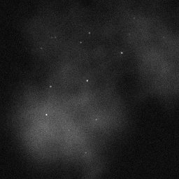
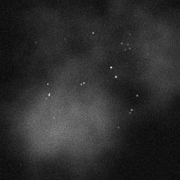
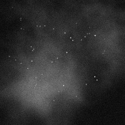

# Super-resolution Microscopy
## Experimental and Integrating Final Project for the minor Modern Physics at TU Delft
Names: Jaap ter Meulen, Niels van Mierlo and Marijn Sluijs

With modern optical technology it is possible to create images of nanometer resolution, 
much smaller than the wavelength of light. One form of super-resolution microscopy is Single Molecule Localization Microscopy. Individual fluorescent molecules are
localized using imaging and computer analysis of the emerging light spot of the molecule.

## Dataset
The following datasets are used in the super-resolution microscopy project:

Simulated data to train on:  
[Tubulins I](https://srm.epfl.ch/DatasetPage?name=Tubulins_I)  
[Tubulins II](https://srm.epfl.ch/DatasetPage?name=Tubulins_II) 
 
Real 2D data:  
[Tubulins 2D](https://srm.epfl.ch/DatasetPage?name=Tubulin-COS7-Flip565-2D)

Two images from the simulated dataset:  

