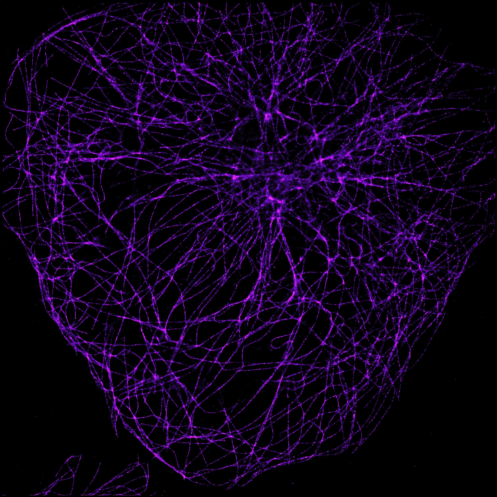
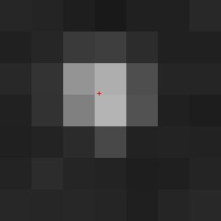
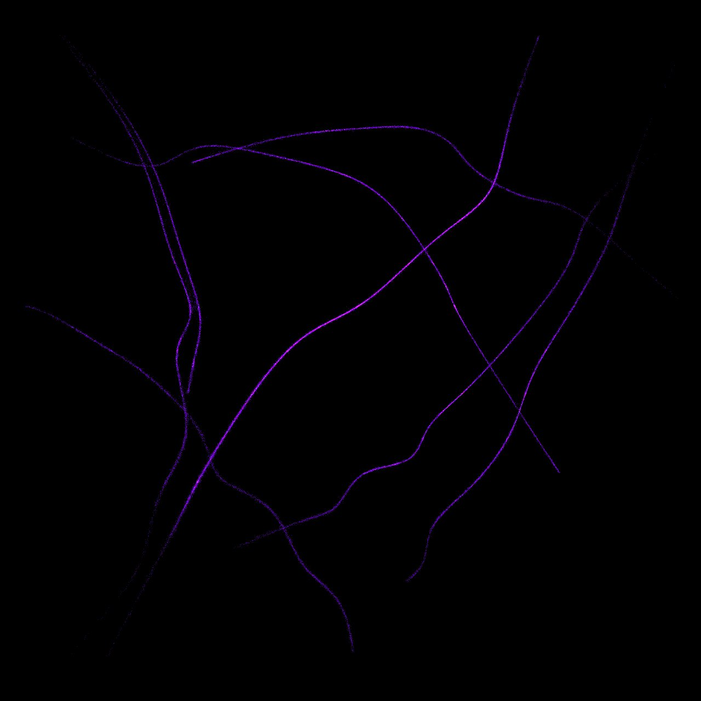

# Super-resolution Microscopy
## Experimental and Integrating Final Project for the minor Modern Physics at TU Delft
Names: Jaap ter Meulen, Niels van Mierlo and Marijn Sluijs

With modern optical technology it is possible to create images of nanometer resolution, 
much smaller than the wavelength of light. One form of super-resolution microscopy is Single Molecule Localization Microscopy. Individual fluorescent molecules are
localized using imaging and computer analysis of the emerging light spot of the molecule. Using algorithms, the location of the molecule can be determined on subpixel level.

## Dataset
The following datasets are used in the super-resolution microscopy project:

Simulated data to train on:  
[Tubulins I](https://srm.epfl.ch/DatasetPage?name=Tubulins_I)  
[Tubulins II](https://srm.epfl.ch/DatasetPage?name=Tubulins_II) 
 
Real 2D data:  
[Tubulins 2D](https://srm.epfl.ch/DatasetPage?name=Tubulin-COS7-Flip565-2D)

The simulated datasets both consist of 2400 microscopic images of 8 tubulins (protein structures), the real 2D dataset consists of 8000 images of high-density tubulins.

Three images from the simulated dataset (Tubulins I):  

## Molecule localization
Using an algorithm to determine the center of mass in an unbounded 2D environment the maximum of every light spot is determined. This is the subpixel location of the fluorescent molecule. The image below shows the light spot of one fluorescent molecule with its subpixel location calculated by the algorithm.

## Super-resolution image
When the subpixel locations of all fluorescent molecules are determined, the locations are combined into one image to create the super-resolution image. On the super-resolution image the tubulins that where placed under microscope can be seen, this was impossible on an individual image from the dataset. The images have been colored to make the pixels more visible.

Super-resolution image created with dataset Tubulins I (Tubulins II gives same image):

Super-resolution image created with dataset Tubulins 2D:

## Comparison
The pixel size of the images in dataset Tubulins 2D is 108 nm. For the super-resolution image we zoomed in 5 times, giving a pixel size of 22 nm.

